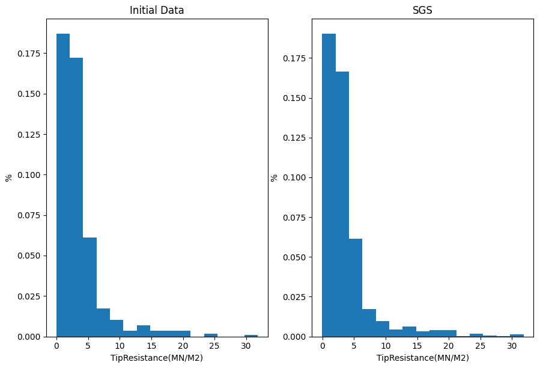

# Geostatistical Simulation in Python

Here we create a 2D model using CPT data in 6 locations. The raw tip resistance is used to develop the model. 


```python
import numpy as np
import pandas as pd
```

### Loading Data


```python
import numpy as np
import pandas as pd
from matplotlib import pyplot as plt

df = pd.read_csv('All Data.csv')

xx= df['X'].to_numpy()
yy= df['Y'].to_numpy()
zz= df['Tip'].to_numpy()

sc= plt.scatter(xx, yy, c=zz, vmin=0, vmax=25, cmap=cmap)
plt.title('Initial Data')
plt.xlabel('Y(m)')
plt.ylabel('Depth(m)')
plt.colorbar(sc)
plt.show()
```


### Normal score transform 


```python
import geostatspy.GSLIB as GSLIB  


df['Ntip'] = GSLIB.nscore(df['Tip'].values)
df.head()
# Check the Tip Resistance normal score transformed distribution
plt.subplot(121)
plt.title('Initial Data')
tip = df['Tip'].to_numpy()
plt.hist(tip, density=True, bins=20)
plt.xlabel('TipResistance(MN/M2)')
plt.ylabel('%')

plt.subplot(122)
plt.title('NormalScore')
Ntip = df['Ntip'].to_numpy()
plt.hist(Ntip, density=True, bins=20)
plt.xlabel('NormalScoreTipResistance')
plt.ylabel('%')
```


### Isotropic Variogram Modeling


```python
lag_dist = 3.5; nlag = 10; azi = 90; atol = 90.0; bstand = 1

lag, por_gamma, por_npair = GSLIB.gamv_2d(df,"X","Y","Ntip",nlag,lag_dist,azi,atol,bstand)

plt.subplot(111)
plt.plot(lag,por_gamma,'x',color = 'black',label = 'Tip Resistance')
plt.plot([0,40],[1.0,1.0],color = 'black')
plt.xlabel(r'Lag Distance $\bf(h)$, (m)')
plt.ylabel(r'$\gamma \bf(h)$')
plt.title('Isotropic Standardized Tip Resistance Variogram')
plt.xlim([0,40])
plt.ylim([0,1.8])

```


### Simulation


```python
nx = 400; ny = 105; cell_size = 0.1                     # grid number of cells and cell size
xmin = 0.0; ymin = -10.5;                                   # grid origin
xmax = xmin + nx * cell_size; ymax = ymin + ny * cell_size  # calculate the extent of model  
seed = 5000                                     # random number seed for stochastic simulation
vmin = -1; vmax = 33; cmap = plt.cm.plasma  # color min and max and using the plasma color map 
Tip_cmin = -1; Tip_cmax = 25

# Conditional simulation - make 1 structure variogram, simulate, transform distribution and visualize
var = GSLIB.make_variogram(nug=0, nst=1, itl=1, cc1=1, azi1=90, hmaj1=5, hmin1=2.5)

cond_Tip_sim = GSLIB.sgsim(1, df, 'X', 'Y', 'Tip', nx, ny, cell_size, seed, var, 'simulation_cond.out')

locpix(cond_Tip_sim, xmin, xmax, ymin, ymax, cell_size, Tip_cmin, Tip_cmax, df, 'X', 'Y', 'Tip', 'Tip Conditional Simu', 'z', 'y',
       'TipResistance', cmap, 'TipRes (MN/M2)')

# utility to convert GSLIB Geo-EAS files to a 1D or 2D numpy ndarray for use with Python methods
sim = GSLIB.GSLIB2Dataframe("simulation_cond.out")
simr = sim.to_numpy()

plt.subplot(121)
plt.title('Initial Data')
plt.hist(tip, density=True, bins=15)
plt.xlabel('TipResistance (MN/M2)')
plt.ylabel('N')

plt.subplot(122)
plt.title('SGS')
plt.hist(simr, density=True, bins=15)
plt.xlabel('TipResistance (MN/M2)')
plt.ylabel('N')

```




#### Changing Seed Number
Seed =1000


The results of realization number 2 with seed number = 1000


#### Making 300 Realizations
To avoid any artifact and/or bias that can result from a combination of a regular path and a restricted search, 300 realizations of Tip_Resistance were generated during sequential Gaussian simulation by varying the seed number and the visiting path. The final model was produced by averaging these 3000 realizations.


```python
seed = 7500
cond_Tip_sim = GSLIB.sgsim(1, df, 'X', 'Y', 'Tip', nx, ny, cell_size, seed, var, 'simulation_cond.out')
sum = cond_Tip_sim

for i in range(1, 300):
    seed = random.randint(100, 10000)
    cond_Tip_sim = GSLIB.sgsim(1, df, 'X', 'Y', 'Tip', nx, ny, cell_size, seed, var, 'simulation_cond.out')
    sum = sum + cond_Tip_sim

cond_Tip_sim = sum / (i + 1)
GSLIB.locpix(cond_Tip_sim, xmin, xmax, ymin, ymax, cell_size, Tip_cmin, Tip_cmax, df, 'X', 'Y', 'Tip', 'Tip_Resistance Conditional Simulation', 'X', 'Y',
       'Tip_Resistance (MN/M2)', cmap, 'TipRes (MN/M2)')

```


The result of Avraging 300 realizations
